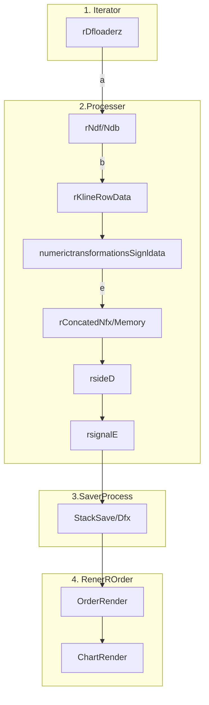

```txt
---
title: "Tour and Travel Website Presentation"
author: "aman kumar"
theme: Copenhagen
aspectratio: 169
---
### Bot
### Static




### Dynamic
```txt

graph TD;
    subgraph 1.
        A[a]
     end

    subgraph 2.
        B[a]
        C[c]
    
    end

    subgraph 3.
        D[d]
    
    end

    subgraph 4. 
        E[e]

    end

   

    A --> |a| B
    B --> |b| C
    C -->  D
    D --> |e| E

```


## Schedulr

```txt

graph TD;
    subgraph 1. Scheduler
	    A[Scheduler/FetchExecManual]
        
     end

	subgraph 1.1. Iterator
		X[rDfloaderz]
	end

    subgraph 2.Processer
        B[rNdf=Stack/Ndb=Supabase]
        C[rKlineRowData]
        D[numerictransformations=Signldata]         		
        E[rConcatedNdfx/Memory]
		F[rsideD]
        G[rsignalE]
    end

    subgraph 3.SaverProcess
	    H[StackSave<--Dfx-->Sbase]
    end

    subgraph 4. RenerROrder
		I[OrderRender]
		J[ChartRender]

    end

   

    A --> |a| X
    X --> B
    B --> |b| C
    C -->  D
    D --> |e| E
    E --> F
    F --> G
    G --> H
    H --> I
	I --> J
```


