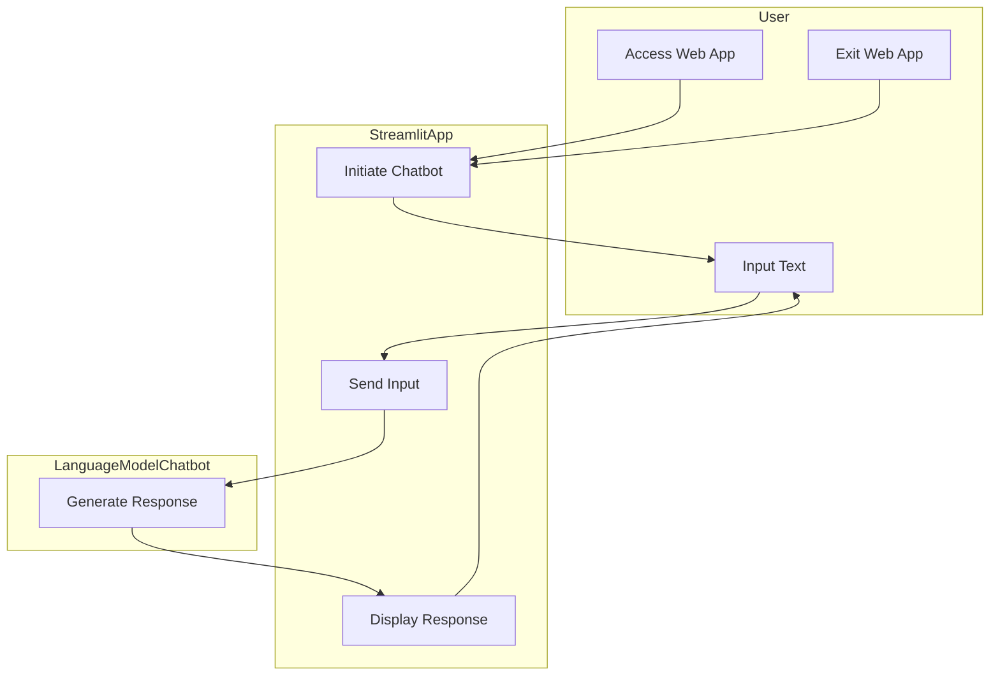
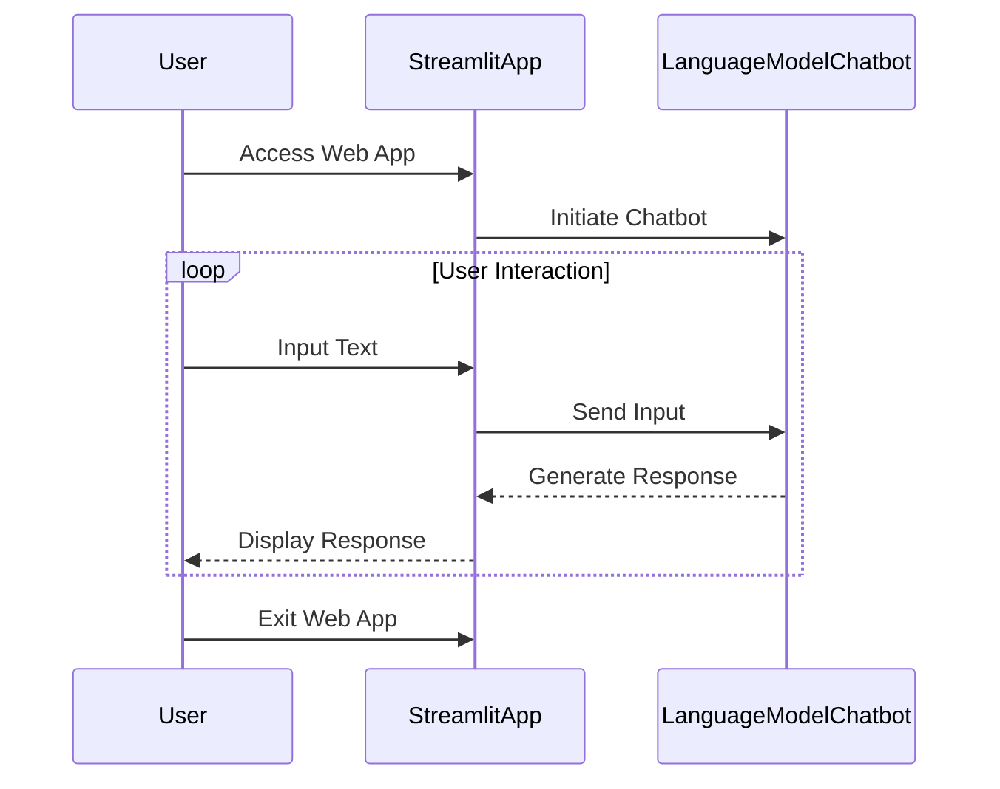

    
### Flowchart:


```txt
graph TD;
    subgraph User
        A[Access Web App]
        B[Input Text]
        C[Exit Web App]
    end

    subgraph StreamlitApp
        D[Initiate Chatbot]
        E[Send Input]
        F[Display Response]
    end

    subgraph LanguageModelChatbot
        G[Generate Response]
    end

    A --> D
    D --> B
    B --> E
    E --> G
    G --> F
    F --> B
    C --> D

```




## Sequence Diagram:


```txt
sequenceDiagram
    participant User
    participant StreamlitApp
    participant LanguageModelChatbot

    User->>StreamlitApp: Access Web App
    StreamlitApp->>LanguageModelChatbot: Initiate Chatbot

    loop User Interaction
        User->>StreamlitApp: Input Text
        StreamlitApp->>LanguageModelChatbot: Send Input
        LanguageModelChatbot-->>StreamlitApp: Generate Response
        StreamlitApp-->>User: Display Response
    end

    User->>StreamlitApp: Exit Web App
```




